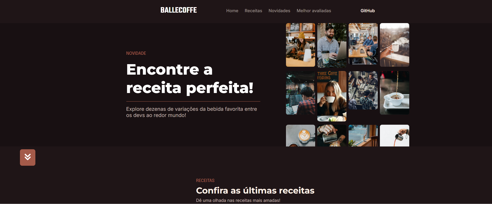

# BalleCoffe - Landing Page

Este projeto é uma **Landing Page** construída como parte de uma aula da **Rafaella Ballerini**. Inicialmente, foi desenvolvida utilizando apenas **HTML e CSS**, proporcionando um design agradável e responsivo.

## Objetivo do Projeto
O objetivo foi criar uma página simples e elegante para apresentar um conceito de cafeteria online. Com uma estrutura bem organizada e estilização moderna, a landing page transmite uma experiência visual agradável.

##  Melhorias e Evolução
Atualmente, estamos trabalhando em melhorias para tornar o projeto **interativo** com **JavaScript**. Algumas das funcionalidades planejadas incluem:
- Adicionar novos cards de receitas
- Criar um formulário para que os usuários possam adicionar novas receitas
- Implementar um botão "Ver Mais" para exibir mais conteúdos
- Melhorar a experiência do usuário com animações e interatividade

##  Tecnologias Utilizadas
- **HTML5**
- **CSS3**
- **(Em breve) JavaScript**

## Estrutura do Projeto
```
BalleCoffe/
│── assets/         # Imagens e ícones
│── index.html      # Estrutura da página
│── style.css       # Estilização da página
│── README.md       # Documentação do projeto
```

## Como Contribuir
Se quiser sugerir melhorias ou contribuir com o projeto, fique à vontade para abrir um **Pull Request** ou relatar **Issues** no repositório!

## Créditos
Projeto desenvolvido com base em uma aula da [Rafaella Ballerini](https://www.youtube.com/@RafaellaBallerini).

## Preview da Landing Page  
